<div align="center">



</div>

<div align="center">

[](https://the-great-movie-vault.vercel.app/)
[](https://github.com/Karan-g-2003/The-Great-Movie-Vault)
[](https://github.com/Karan-g-2003/The-Great-Movie-Vault/issues)
[](LICENSE)

</div>

---

> *"Stop scrolling. Start watching."*
>
> The Great Movie Vault is a **free, intelligent movie discovery engine** that understands mood, vibe, decade, region, and genre — and finds your next obsession in seconds. No account. No subscription. Just cinema.

---

## 🎭 What Makes This Different

Most movie apps give you a list. The Vault gives you an **experience.**

Under the hood, a custom **Bayesian scoring engine** — the same formula behind IMDb's Top 250 — is combined with fuzzy search, MMR diversity injection, and a taste profile that adapts to you. The result feels less like a filter and more like talking to someone who genuinely loves movies.

```
You type:  "mind-bending 90s thriller"
The Vault: Seven. Memento. The Usual Suspects. Dark City. 12 Monkeys.
```

---

## ✨ Features

<table>
<tr>
<td width="50%" valign="top">

### 🤖 &nbsp;Natural Search
Search by anything — no dropdowns required.

- **Moods** → Happy, Melancholic, Tense, Eerie
- **Vibes** → Cyberpunk, Surreal, Noir, Mind-bending
- **Decades** → 80s, 90s, 2000s, Golden Age Classics
- **Regions** → Bollywood, Korean, Japanese, French, Tamil
- **Combos** → *"feel-good Korean drama 2020s"*

</td>
<td width="50%" valign="top">

### 🧮 &nbsp;The Algorithm
Five signals. Zero compromise.

| Signal | Weight |
|--------|--------|
| Bayesian Weighted Rating | 30% |
| Genre Jaccard Match | 20% |
| Levenshtein Title Fuzzy | 25% |
| Popularity (log-norm) | 15% |
| Freshness Decay | 10% |

</td>
</tr>
<tr>
<td width="50%" valign="top">

### 🎨 &nbsp;The UI
Feels like it costs money. Doesn't.

- Glassmorphism panels with backdrop blur
- 3D tilt cards with hover glow
- SVG rating rings (circular progress)
- Skeleton shimmer loading states
- Staggered entrance animations
- Animated gradient mesh background

</td>
<td width="50%" valign="top">

### 🌍 &nbsp;Global Cinema
No Hollywood bias. All of Earth's stories.

- 🇮🇳 Bollywood · Tamil · Telugu
- 🇰🇷 Korean · 🇯🇵 Japanese
- 🇫🇷 French · 🇪🇸 Spanish
- 🇨🇳 Chinese · 🇩🇪 German
- 🌐 + every corner of world cinema

</td>
</tr>
</table>

---

## 🧠 Algorithm Deep Dive

```
┌──────────────────────────────────────────────────────────────┐
│  YOUR QUERY                                                  │
│  "90s cyberpunk thriller"                                    │
└────────────────────────┬─────────────────────────────────────┘
                         │
                         ▼
┌──────────────────────────────────────────────────────────────┐
│  TOKENIZER & PARSER                                          │
│  Decade → 1990–1999   Vibe → cyberpunk   Genre → thriller   │
└────────────────────────┬─────────────────────────────────────┘
                         │
                         ▼
┌──────────────────────────────────────────────────────────────┐
│  MULTI-STRATEGY FALLBACK CHAIN                               │
│  1. Discovery Search (genre + keyword + year range)          │
│  2. Person Search (actor/director filmography)               │
│  3. Title Search + Levenshtein fuzzy correction              │
└────────────────────────┬─────────────────────────────────────┘
                         │
                         ▼
┌──────────────────────────────────────────────────────────────┐
│  BAYESIAN SCORING ENGINE                                     │
│                                                              │
│  WR = (v / v+m) × R  +  (m / v+m) × C                       │
│                                                              │
│  Composite score merges: title match · rating · popularity   │
│  freshness · genre overlap                                   │
│                                                              │
│  MMR diversity pass — no monotonous result sets              │
│  Fisher-Yates weighted shuffle — controlled discovery        │
└────────────────────────┬─────────────────────────────────────┘
                         │
                         ▼
┌──────────────────────────────────────────────────────────────┐
│  🎬  RESULTS — glassmorphism cards, trailers, streaming info │
└──────────────────────────────────────────────────────────────┘
```

---

## 🚀 Tech Stack

<div align="center">

| Layer | Technology | Why |
|:---:|:---:|:---|
| UI Framework | **React 19** | Concurrent features, fast renders |
| Build Tool | **Vite 7** | Sub-second HMR, optimized output |
| Styling | **Tailwind CSS 3** | Utility-first, zero bloat |
| Icons | **Lucide React** | Crisp, consistent icon system |
| Movie Data | **TMDb API** | 40M+ titles, trailers, streaming |
| Scoring | **Custom Engine** | Bayesian WR + MMR + Fuzzy match |

</div>

---

## 🛠️ Run It Locally

```bash
# Clone
git clone https://github.com/Karan-g-2003/The-Great-Movie-Vault.git
cd The-Great-Movie-Vault

# Add your TMDb API key → https://www.themoviedb.org/settings/api
echo "VITE_TMDB_API_KEY=your_key_here" > .env

# Install & run
npm install
npm run dev
# → http://localhost:5173
```

```bash
# Production build
npm run build
npm run preview
```

---

## 📂 Architecture

```
the-great-movie-vault/
├── 📄 index.html          # SEO-optimized (OG, JSON-LD, FAQ schema)
├── 📁 public/
│   ├── favicon.svg        # Custom clapperboard logo
│   ├── manifest.json      # PWA manifest
│   ├── robots.txt         # 15+ AI bot rules
│   └── sitemap.xml
└── 📁 src/
    ├── 🎯 App.jsx         # Main application
    ├── 🧮 scoring.js      # Bayesian engine
    ├── 🗄️  db.js           # Taste profile (localStorage)
    ├── 🧩 components.jsx  # RatingRing · MovieCard · Skeleton
    └── 🎨 App.css         # Glassmorphism design system
```

---

## 🎬 Try These Searches

```
"mind-bending sci-fi"          → Inception, Interstellar, Annihilation
"feel-good 90s comedy"         → Home Alone, Mrs. Doubtfire, Clueless
"dark Korean thriller"         → Parasite, Oldboy, I Saw the Devil
"classic Bollywood romance"    → Dilwale, KKHH, Dil Chahta Hai
"slow burn psychological"      → Black Swan, A Beautiful Mind, Shutter Island
"80s action blockbuster"       → Die Hard, Predator, RoboCop
```

---

## 🤝 Contributing

```bash
# 1. Fork the repo
# 2. Create your branch
git checkout -b feature/your-idea

# 3. Commit with intention
git commit -m "feat: add your-idea"

# 4. Push & open a PR
git push origin feature/your-idea
```

All contributions welcome — algorithm improvements, UI polish, new region support, bug fixes.

---

<div align="center">

**Made with obsession for cinema by [Karan Ghuwalewala](https://github.com/Karan-g-2003)**

*If this saved you from watching something terrible — drop a ⭐*

[](https://the-great-movie-vault.vercel.app/)

</div>
